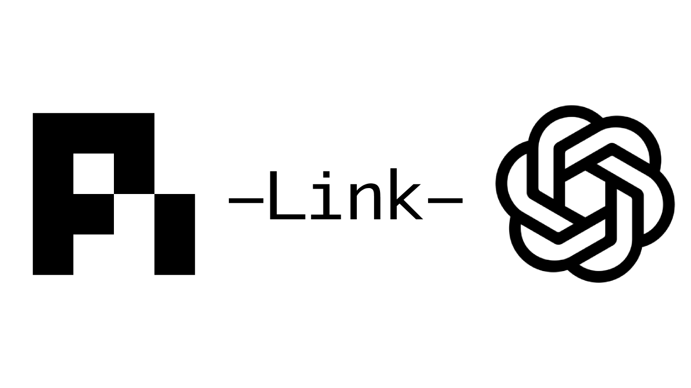

# PiLink

<p align="center">
  
</p>

An OAuth-protected MCP server that exposes the Pi Agent coding-tool harness over Streamable HTTP (and legacy SSE). It is designed for a **single trusted owner** connecting a remote MCP client such as ChatGPT to a local development machine.

See [the complete getting-started guide](docs/GETTING_STARTED.md) for first-time setup and ChatGPT OAuth configuration.

## Quick start

Prerequisite: Node.js 22.19+. On Linux, the first `start` automatically downloads the selected hosting binary (official Cloudflare `cloudflared` for a Quick Tunnel or Caddy for direct `nip.io` HTTPS) to the private PiLink configuration directory. On macOS and Windows, install the selected hosting binary yourself first.

```bash
npx pilink start --allow-unsafe-full-access
```

The first run creates `~/.config/pilink/.env` with mode `0600`, asks how to expose PiLink publicly, then guides you through ChatGPT's user-defined OAuth setup and waits for its callback URL. `pilink init` creates the private configuration without starting the server. `pilink serve` starts without public hosting for reverse-proxy or local use.

Set `PI_CLOUDFLARED_PATH` when your preferred `cloudflared` binary is outside `PATH`, or `PI_CLOUDFLARED_URL` to use a custom mirror for automatic downloads.

## Public hosting choices

The first `pilink start` asks which public hosting mode to save. When an existing configuration is found, `pilink start --setup` interactively asks whether to overwrite/reset the existing instance (which deletes PiLink-generated state, OAuth clients, managed hosting binaries, and Caddy TLS state before starting fresh) or create a new separate instance with a custom config directory and port (leaving the original instance untouched). It does not delete your repository or workspace:

- **Cloudflare Quick Tunnel** is the default and needs no account, router change, or additional setup. Its hostname changes every restart. ChatGPT treats each hostname as a new connector, so create a new connector and OAuth client with `pilink start --setup` after every Quick Tunnel restart.
- **Direct `nip.io` HTTPS hosting** keeps a hostname such as `https://pilink-203-0-113-10.nip.io` while your public IPv4 address remains unchanged. PiLink downloads and runs [Caddy](https://caddyserver.com/) on Linux to provide trusted HTTPS automatically, then, with explicit confirmation, tries UPnP and NAT-PMP to create temporary router mappings for public TCP `80` and `443`. It renews them while running and removes them on shutdown. This exposes your computer to the Internet; do not enable unsafe full access unless every authorized client is fully trusted.

If Linux uses firewalld, allow Caddy's forwarded ports before starting direct hosting: `sudo firewall-cmd --permanent --add-port=8080/tcp`, `sudo firewall-cmd --permanent --add-port=8443/tcp`, then `sudo firewall-cmd --reload`.

Automatic mapping cannot bypass CGNAT, ISP port blocking, or routers that disable UPnP/NAT-PMP. PiLink falls back to manual port-forwarding instructions in those cases. If your public IP changes, its `nip.io` hostname changes too and ChatGPT needs a new connector.

## Security model

The default mode is deliberately restrictive: file tools are jailed to `PI_WORK_DIR` (including symlink-escape checks) and `bash` is unavailable. This is appropriate for a public tunnel.

`--allow-unsafe-full-access` enables unrestricted shell and filesystem access for every authorized MCP client. It is remote code execution by design; only use it with a private configuration, a trusted ChatGPT profile, and a machine/account you are willing to expose. PiLink cannot make arbitrary shell commands safe without an OS-level sandbox.

Client registration requires the generated `PI_BOOTSTRAP_SECRET` as an RFC 7591 registration access token:

```bash
curl -X POST "$SERVER_URL/oauth/register" \
  -H "Authorization: Bearer $PI_BOOTSTRAP_SECRET" \
  -H 'Content-Type: application/json' \
  -d '{"client_name":"trusted-client","grant_types":["client_credentials"],"scope":"mcp:tools"}'
```

Keep that secret out of ChatGPT prompts, logs, source control, and public configuration. A client must support registration access tokens (or be pre-registered) to use the protected dynamic-registration endpoint.

## Configuration

`pilink init` documents the generated values. See `.env.example` for manual or deployment configuration. The server rejects startup if `JWT_SECRET` or `PI_BOOTSTRAP_SECRET` is missing or shorter than 32 characters. `SERVER_URL` must be the externally visible HTTPS URL when using a reverse proxy or tunnel.

OAuth tokens are audience/issuer-bound, expire after `TOKEN_EXPIRY` seconds (default 360000000000), and preserve their scopes for the lifetime of an MCP session. `mcp:read` permits only read/search tools, `mcp:write` permits mutation (and bash when unsafe mode is explicitly enabled), and `mcp:tools` permits all tools subject to the harness mode.

## Development and publishing

```bash
npm ci
npm test
```

### Run a local checkout as `pilink`

From the repository root, run the local CLI without a global installation:

```bash
npm exec -- pilink start --setup
```

To make `pilink` available in your shell permanently without `sudo`, configure npm to use a directory owned by your user, add it to `PATH`, then link this checkout:

```bash
npm config set prefix "$HOME/.local"
printf '\nexport PATH="$HOME/.local/bin:$PATH"\n' >> ~/.bashrc
source ~/.bashrc
npm link
```

After that, `pilink start --setup` works from any directory. The default npm global prefix may be `/usr`, where `npm link` fails with `EACCES` for non-root users; do not use `sudo` to work around that error.

The package contains only `dist`, this README, and the MIT license.

## Credits & Acknowledgments

PiLink builds upon the excellent **Pi Agent** ecosystem:
- **[Pi Agent (`@earendil-works/pi-coding-agent`)](https://www.npmjs.com/package/@earendil-works/pi-coding-agent)**: The powerful underlying coding-agent tool harness providing structured file operations, grep search, symbol analysis, and command execution capability.
