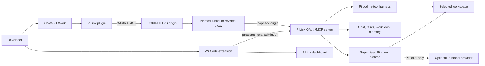
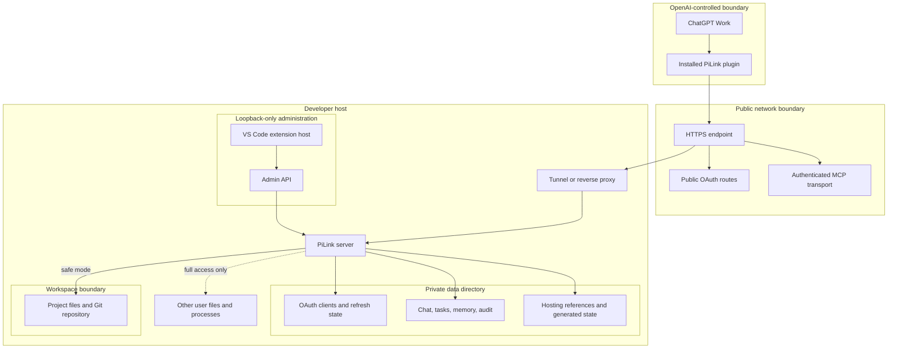
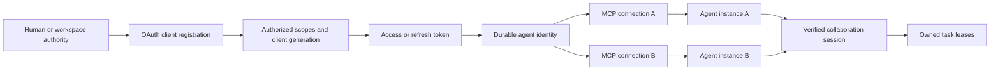

# Architecture

PiLink is a local execution bridge, not a hosted model and not a replacement
ChatGPT frontend. It combines four independently authenticated surfaces:

1. ChatGPT Work and its installed plugin;
2. the public OAuth/MCP server;
3. the loopback-only VS Code administration channel;
4. the optional Pi Local provider/runtime.

Keeping those identities separate prevents a model-provider login, an OAuth
client, or the VS Code host from being mistaken for one another.

## Runtime model

The ChatGPT page is opened in VS Code's Integrated Browser when available. It
is not loaded into the PiLink webview. PiLink therefore does not read its
DOM, cookies, composer, reasoning, or transcript.

## Product runtime modes

The core server has two capability modes, selected by the local operator with
`PI_RUNTIME_MODE` or the CLI's `--mode` option:

- **Single agent** (`single`) constructs the classic remote workspace harness
  and transport without public chat, task, memory, work-loop, or remote
  agent-management tools. When a Pi provider is configured, the loopback-only
  VS Code administration surface may supervise exactly one local agent without
  coordination permissions.
- **Collaborative public chat** (`collaboration`) adds the verified durable
  collaboration services and the optional supervised Pi runtime. The extra
  services still require their own OAuth scopes, provider configuration, and
  private-state checks.

The **VS Code graphical** entry (`--mode vscode`) is a handoff/presentation
surface, not a third core mode. Its dashboard contains controls for both core
modes and separately exposes **ChatGPT MCP** and **Pi Local**. The former is a
remote OAuth/MCP client; the latter uses a configured Pi provider. Neither
surface changes the core security policy by itself.

Mode selection is an operator action and is latched for the process lifetime.
Changing it requires a restart so every MCP connection receives one coherent
tool catalog. A model-visible prompt, public chat message, task artifact, or
workspace file cannot select or elevate the mode.

## Trust boundaries

Public clients never receive the local administration bootstrap secret. The
dashboard reaches administrative projections through loopback checks and a
private host credential. Public health information is aggregate and must not
contain secrets, prompts, paths, or tool results.

## Identity and session model

One OAuth client represents one durable remote identity. Multiple concurrent
MCP connections can share that identity but receive distinct server-minted
instance IDs. Collaboration roles and sessions are verified server-side;
caller-supplied names do not grant authority.

Transport sessions are pinned to the OAuth client, credential generation, and
scope set that created them. A later narrower token must not reuse a more
privileged session. Disabling or rotating a client invalidates its previous
tokens and active transports.

## MCP and OAuth

The public server supports:

- Streamable HTTP with `POST`, `GET`, and `DELETE /sse`;
- legacy SSE with `GET /sse` and `POST /messages`;
- OAuth Authorization Code with PKCE;
- refresh-token rotation and revocation;
- client-credentials clients for supported local integrations;
- Dynamic Client Registration for the constrained ChatGPT compatibility path;
- user-defined confidential clients as a compatibility fallback;
- protected-resource and authorization-server discovery metadata.

OAuth scopes gate tools, but scopes do not make unsafe actions safe. Workspace
mode, repository-execution policy, explicit execution approval, and full-access
policy remain additional checks.

## Tool layers

### Workspace harness

- `read`, `grep`, `find`, and `ls` inspect the configured workspace.
- `edit` and `write` mutate workspace files when the token permits writes.
- `run` exposes fixed Git inspection profiles and opt-in npm build/test
  profiles.
- `bash` exists only in explicit unrestricted mode.

### Collaboration

- `agent_chat_post` and `agent_chat_read` provide a small durable coordination
  feed plus `pilink://agent-chat` notifications.
- `agent_task_*` implements create/read/claim/input/release/finish lifecycle.
- `collaboration_bootstrap`, role prompts, and resumable sessions bind
  collaboration context server-side.
- `agent_work_*` implements waiting, listing, and manager release.
- `agent_memory_*` exposes governed read-only projections.
- audit/progress services retain bounded operational metadata without tool
  arguments, file contents, prompts, or results.

### Supervised Pi agents

PiLink adds local agent runtime operations for spawn, list, status, output,
follow-up, cancellation, and stop. These agents require a configured Pi Local
provider/model. They do not create new ChatGPT conversations and do not grant a
remote ChatGPT session extra authority.

## Data placement

The configured workspace and private data directory must be separate. Durable
coordination and audit data is namespaced by a project/workspace hash under the
private data directory. Placing that directory under the workspace would let
workspace tools inspect or alter security-relevant state, so collaboration
services fail closed when the layout is unsafe.

Typical private state includes:

- server/JWT/bootstrap secrets;
- OAuth clients, revocation, and refresh state;
- agent chat, tasks, collaboration sessions, memory, and audit records;
- generated hosting configuration and binary references;
- Pi Local provider credentials stored by the supported credential path.

Private state is host-local. Do not share a live data directory between
machines through NFS or another distributed filesystem.

## Hosting model

The sidecar listens on loopback. HTTPS is terminated by an operator-managed
reverse proxy, Cloudflare Named/Quick Tunnel, or the legacy direct `nip.io`
path. Named Tunnel and existing-domain modes keep a stable OAuth issuer and
resource origin. Quick Tunnel changes origin on restart and is therefore an
evaluation mode.

## Execution modes

| Mode | Filesystem | Processes |
| --- | --- | --- |
| Open folder | Canonical selected workspace only | Fixed read-only profiles; build/test only after explicit opt-in |
| Open folder + execution approval | Same workspace boundary | Sensitive enabled profiles require fresh client elicitation |
| Full access | All paths available to the PiLink OS user | General commands available to an explicitly authorized client |
| Pi Local | Uses the selected workspace/runtime mode | Model calls use the configured provider |

None of these modes is an OS sandbox. Even a repository build executed from
safe workspace mode can run arbitrary repository code as the PiLink user.
