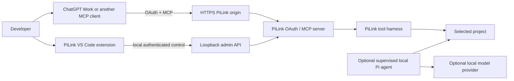
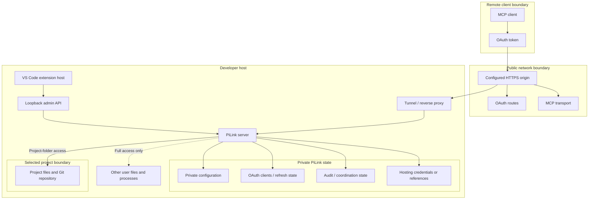

# Architecture

PiLink is a local execution bridge. It exposes a selected project through an
OAuth-protected MCP server and lets a remote client such as ChatGPT Work invoke
that server's tools.

The optional PiLink VS Code extension is a launcher/status panel for that
bridge. It starts and stops PiLink, coordinates ordinary hosting/OAuth setup,
and shows bounded operational status. It is not a second chat frontend.



## Core server modes

The PiLink server has two capability modes:

- **Single agent** (`PI_RUNTIME_MODE=single`) is the normal/default bridge. It
  exposes the workspace harness and OAuth/MCP transport without the shared
  collaboration toolset.
- **Collaboration** (`PI_RUNTIME_MODE=collaboration`) adds durable agent chat,
  tasks, memory/work-loop coordination, and remote supervised-agent controls.

`pilink start --mode vscode` is only a graphical handoff into the VS Code
extension. It is not a third server capability mode and must not be stored as
`PI_RUNTIME_MODE=vscode`.

Fresh ordinary graphical setups use **Single agent**. The main launcher does not
advertise collaboration as a peer choice. Existing collaboration configurations
are detected rather than silently rewritten, and the retained Advanced setup
compatibility flow may expose a workflow selector to an operator who enters it
deliberately.

Changing the mode requires a server restart so existing and new MCP transports
cannot observe different capability catalogs from the same process.

See [Runtime mode selection](operations/mode-selection.md).

## VS Code extension role

The extension owns presentation and local orchestration, not the server's
security policy.

Its ordinary lifecycle is:

```text
choose project -> safe Quick start or Local only -> connect OAuth client
      -> use PiLink from ChatGPT Work -> stop/recover when needed
```

The main dashboard intentionally exposes only the next useful action and three
high-value facts: server state, endpoint state, and ChatGPT OAuth/session state.

**Advanced setup...** is a compatibility/operator path for stable or legacy
hosting and other specialist configuration. It is deliberately distinct from
the normal one-click path.

Local provider-backed agents, native VS Code MCP integration, manual OAuth
registration, collaboration operation, and Full-access launch can remain in the
backend/CLI for compatibility without becoming parallel graphical products.

The dashboard webview never needs the ChatGPT DOM, cookies, transcript,
composer, or model reasoning. ChatGPT remains in its own client surface.

## Trust boundaries



The important separations are:

- public MCP clients never receive the local bootstrap/admin credential;
- provider credentials for the optional local agent do not authorize MCP;
- MCP OAuth does not sign into a model provider;
- collaboration mode does not imply Full access;
- Full access does not imply root privileges, but it does give the authorized
  client the PiLink OS user's filesystem/process authority;
- private PiLink state must stay outside the project capability root.

For the complete threat model see [Security model](SECURITY_MODEL.md).

## Project-folder access

Project-folder access is the normal boundary. Workspace tools resolve paths
against the selected canonical project and a general shell is not exposed.
Repository execution is controlled separately by PiLink's execution policy.

Both normal graphical first-run buttons choose this boundary.

## Full access

Full access is an explicit exception for a reviewed OAuth client. It enables
machine-wide file access and process execution as the PiLink OS user.

Because it is qualitatively different from the normal bridge, the VS Code
launcher does not offer Full access as a normal start action. If it detects an
existing Full-access configuration, it replaces the ordinary start state with a
visible safety state. Quick start and Local only never request it.

Operators who actually need Full access should use the explicit CLI controls or
deliberately review the retained Advanced setup compatibility flow and its
warning/confirmation.

Full access is client-specific. It must not be implemented as a wildcard grant
for every registered OAuth client.

## OAuth and connection state

PiLink treats registration, durable authorization, and a live MCP transport as
separate lifecycle states.

```text
registered -> authorized -> token/refresh state -> MCP transport active
```

A client can therefore be **OAuth ready** while no MCP transport is open. That
is healthy: the remote client may create a transport only when it invokes a
PiLink tool.

The launcher reflects this distinction so users do not re-register OAuth merely
because the transport is idle.

## Local administration

The extension reads operational state through loopback-only admin endpoints
protected by the PiLink bootstrap credential. Before sending privileged admin
requests it verifies the local server identity with the authenticated health
challenge.

This channel can expose bounded operational information needed by the GUI, such
as runtime state, active MCP-session counts, and compatibility projections.

Private credentials, prompts, workspace file contents, OAuth token hashes, and
model reasoning must not cross into the webview state.

## Tool activity

The MCP harness records bounded tool-audit metadata independently from the
private ChatGPT transcript. The audit record is intended for operational
questions such as whether a tool ran, whether it succeeded, and how long it
took.

The launcher may display that metadata when it is available through the current
admin projection. In modes where that projection is unavailable, the activity
section remains absent. The UI must never turn the audit stream into a prompt,
path, argument, or result viewer.

## Collaboration mode

Collaboration is additive. When enabled, PiLink may construct durable services
for:

- agent chat;
- task ownership and leases;
- memory projections;
- work-loop coordination;
- verified collaboration sessions;
- supervised-agent orchestration.

Those services use private state outside the workspace and remain subject to
OAuth scope, identity verification, provider configuration where applicable,
and the same filesystem/process access policy as the base harness.

When collaboration is disabled, its public tools are not registered. Existing
private collaboration data can remain on disk without becoming visible through
the Single-agent catalog.

The normal VS Code launcher does not provide a collaboration console or enable
button. Existing collaboration mode is shown as advanced migration state, while
CLI/operator compatibility paths remain available when collaboration is truly
needed.

## Optional local Pi agent

The extension backend retains a loopback-managed provider-backed agent runtime
for compatibility/operator use. This is an optional local capability, not a
peer product mode in the current graphical launcher.

The local agent has its own provider/model configuration and authentication.
It can be ignored completely when the extension is used only as a graphical
launcher for remote MCP access.

## Hosting

Hosting is independent from runtime mode and access mode. PiLink can operate
with:

- a Cloudflare fixed/Named Tunnel;
- an operator-managed HTTPS reverse proxy;
- a temporary Cloudflare Quick Tunnel;
- local-only serving;
- the legacy `nip.io` path.

A remote ChatGPT client needs a reachable HTTPS origin. Local-only operation is
valid for same-machine clients but cannot be reached by ChatGPT web.

Quick start deliberately uses a temporary Quick Tunnel. Recreating it changes
the public origin. Stable and legacy hosting live in Advanced setup because
they require more operator choices.

## Process ownership

A PiLink configuration/port should have one active owner. The CLI, VS Code
extension, and managed hosting services must not race to run independent copies
against the same private state.

The extension supervisor distinguishes extension-owned processes from managed
services and external listeners. Mode changes or reconfiguration refuse unsafe
handoffs rather than silently starting a second owner.

## Packaging boundary

The VS Code extension ships the PiLink sidecar runtime but keeps the GUI source
separate from the core server implementation:

- `src/` — core server, OAuth, MCP, security, audit, and agent services;
- `packages/vscode/src/` — VS Code process/orchestration layer;
- `packages/vscode/media/app.js` — dashboard state/rendering logic;
- `packages/vscode/media/app.css` — VS Code-themed dashboard styling;
- `packages/vscode/test/` — extension contracts;
- `docs/` — public operating and security guidance.

The legacy `media/main.js` and `media/styles.css` dashboard files were removed
and the release verifier rejects a VSIX that contains them. There should be one
active UI implementation, not two competing versions.

## Design rule

The architectural rule for future extension work is:

> if a feature is not needed to choose a project, start/stop PiLink, understand
> endpoint/OAuth state, or recover a common bridge failure, it does not belong
> in the normal dashboard.

Compatibility can remain in the backend or an explicitly advanced/operator
path without making the primary VS Code product complicated again.
