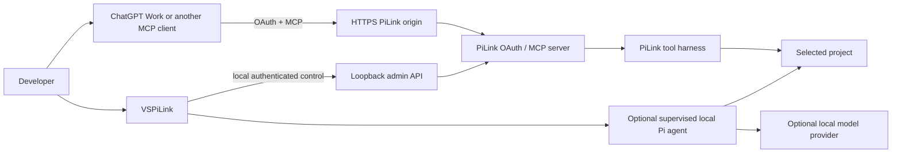

# Architecture

PiLink is a local execution bridge. It exposes a selected project through an
OAuth-protected MCP server and lets a remote client such as ChatGPT Work invoke
that server's tools.

VSPiLink is the optional VS Code control surface for that bridge. It starts and
stops PiLink, manages hosting and OAuth setup, and shows bounded operational
status. It is not a second chat frontend.



## Core server modes

The PiLink server has two capability modes:

- **Single agent** (`PI_RUNTIME_MODE=single`) is the normal/default bridge. It
  exposes the workspace harness and OAuth/MCP transport without the shared
  collaboration toolset.
- **Collaboration** (`PI_RUNTIME_MODE=collaboration`) adds durable agent chat,
  tasks, memory/work-loop coordination, and remote supervised-agent controls.

`pilink start --mode vscode` is only a graphical handoff into VSPiLink. It is
not a third server capability mode and must not be stored as
`PI_RUNTIME_MODE=vscode`.

VSPiLink defaults new graphical setups to **Single agent**. Collaboration is an
explicit advanced opt-in because it changes the public MCP capability catalog.
Changing the mode restarts the server so existing and new MCP transports cannot
observe different catalogs from the same process.

See [Runtime mode selection](operations/mode-selection.md).

## VSPiLink's role

The extension owns presentation and local orchestration, not the server's
security policy.

Its ordinary lifecycle is:

```text
choose project -> start PiLink -> obtain HTTPS endpoint -> connect OAuth client
      -> use PiLink from ChatGPT Work -> stop/reconfigure when needed
```

The main dashboard intentionally exposes only the next useful action and three
high-value facts: server state, remote/OAuth state, and the current access
boundary.

Optional capabilities such as collaboration, Full access, manual OAuth client
registration, VS Code's native MCP provider, and the local provider-backed Pi
agent live under **Advanced**.

The dashboard webview never needs the ChatGPT DOM, cookies, transcript,
composer, or model reasoning. ChatGPT remains in its own client surface.

## Trust boundaries


The important separations are:

- public MCP clients never receive the local bootstrap/admin credential;
- provider credentials for the optional local agent do not authorize MCP;
- MCP OAuth does not sign into a model provider;
- collaboration mode does not imply Full access;
- Full access does not imply root privileges, but it does give the authorized
  client the PiLink OS user's filesystem/process authority;
- private PiLink state must stay outside the project capability root.

For the complete threat model see [Security model](SECURITY_MODEL.md).

## Project-folder access

Project-folder access is the normal boundary. Workspace tools resolve paths
against the selected canonical project and a general shell is not exposed.
Repository execution is controlled separately by PiLink's execution policy.

The graphical first-run path always chooses this boundary.

## Full access

Full access is an explicit exception for a reviewed OAuth client. It enables
machine-wide file access and process execution as the PiLink OS user.

Because it is qualitatively different from the normal bridge, VSPiLink keeps
it behind Advanced and does not present a saved Full-access configuration as an
ordinary safe start. The dashboard visibly labels the state while it is
configured or active.

Full access is client-specific. It must not be implemented as a wildcard grant
for every registered OAuth client.

## OAuth and connection state

PiLink treats registration, durable authorization, and a live MCP transport as
separate lifecycle states.

```text
registered -> authorized -> token/refresh state -> MCP transport active
```

A client can therefore be **OAuth ready** while no MCP transport is open. That
is healthy: the remote client may create a transport only when it invokes a
PiLink tool.

VSPiLink's main status reflects this distinction so users do not re-register
OAuth merely because the transport is idle.

## Local administration

The extension reads operational state through loopback-only admin endpoints
protected by the PiLink bootstrap credential. Before sending privileged admin
requests it verifies the local server identity with the authenticated health
challenge.

This channel can expose bounded operational information needed by the GUI, such
as runtime state, active MCP-session counts, managed agents, and collaboration
projections when that mode is enabled.

Private credentials, prompts, workspace file contents, OAuth token hashes, and
model reasoning must not cross into the webview state.

## Tool activity

The MCP harness records bounded tool-audit metadata independently from the
private ChatGPT transcript. The audit record is intended for operational
questions such as whether a tool ran, whether it succeeded, how long it took,
and which access boundary applied.

The dashboard may display that metadata when it is available through the
current admin projection. It must not turn the audit stream into a prompt or
result viewer.

## Collaboration mode

Collaboration is additive. When enabled, PiLink may construct durable services
for:

- agent chat;
- task ownership and leases;
- memory projections;
- work-loop coordination;
- verified collaboration sessions;
- supervised-agent orchestration.

Those services use private state outside the workspace and remain subject to
OAuth scope, identity verification, provider configuration where applicable,
and the same filesystem/process access policy as the base harness.

When collaboration is disabled, its public tools are not registered. Existing
private collaboration data can remain on disk without becoming visible through
the Single-agent catalog.

## Optional local Pi agent

VSPiLink retains a loopback-managed provider-backed agent runtime for users who
want it. This is an optional local capability, not a peer product mode.

The local agent has its own provider/model configuration and authentication.
It can be ignored completely when the extension is used only as a graphical
launcher for remote MCP access.

## Hosting

Hosting is independent from runtime mode and access mode. PiLink can operate
with:

- a Cloudflare fixed/Named Tunnel;
- an operator-managed HTTPS reverse proxy;
- a temporary Cloudflare Quick Tunnel;
- local-only serving;
- the legacy `nip.io` path.

A remote ChatGPT client needs a reachable HTTPS origin. Local-only operation is
valid for same-machine clients but cannot be reached by ChatGPT web.

Quick Tunnel is intentionally temporary; recreating it changes the public
origin and therefore invalidates assumptions tied to the old URL.

## Process ownership

A PiLink configuration/port should have one active owner. The CLI, VSPiLink,
and managed hosting services must not race to run independent copies against
the same private state.

The extension supervisor distinguishes extension-owned processes from managed
services and external listeners. Mode changes or reconfiguration refuse unsafe
handoffs rather than silently starting a second owner.

## Packaging boundary

The VS Code extension ships the PiLink sidecar runtime but keeps the GUI source
separate from the core server implementation:

- `src/` — core server, OAuth, MCP, security, audit, and agent services;
- `packages/vscode/src/` — VS Code process/orchestration layer;
- `packages/vscode/media/app.js` — dashboard state/rendering logic;
- `packages/vscode/media/app.css` — VS Code-themed dashboard styling;
- `packages/vscode/test/` — extension contracts;
- `docs/` — public operating and security guidance.

The removed legacy dashboard is not packaged alongside the new control surface.
There should be one active UI implementation, not two competing versions.

## Design rule

The architectural rule for future VSPiLink work is:

> if a feature is not needed to choose a project, start/stop PiLink, understand
> the connection state, or recover a common failure, it belongs under Advanced
> or outside the main dashboard.

That keeps the extension aligned with PiLink's original purpose while allowing
the more specialized collaboration and local-agent capabilities to remain
available for users who deliberately need them.
