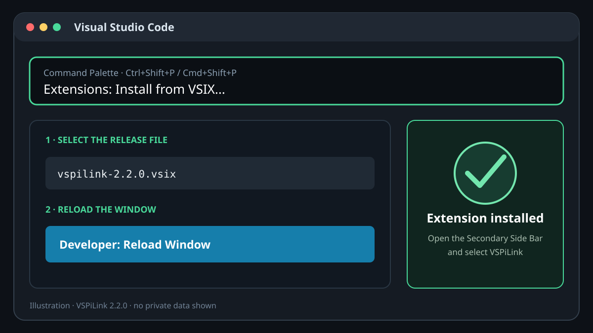
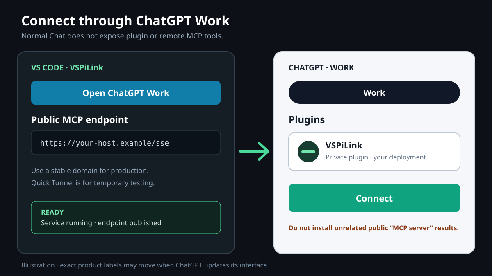
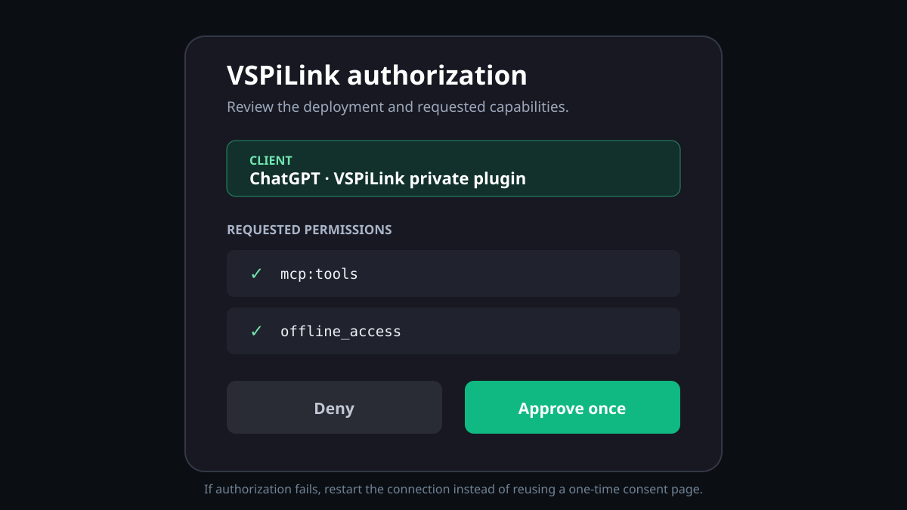
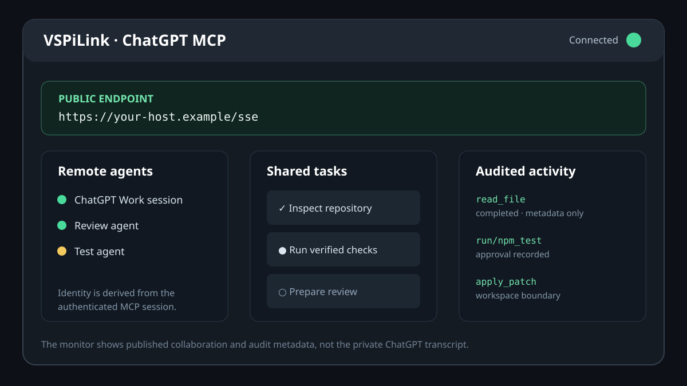

# Illustrated setup walkthrough

These sanitized illustrations show the optional VSPiLink extension in the
PiLink 2.2.0 release flow without
including a real username, filesystem path, domain, OAuth code, or credential.
ChatGPT labels can move as the web product changes; the canonical text guide
in [Connect ChatGPT Work](CONNECT_CHATGPT.md) remains authoritative.

## 1. Install the extension

Open the Command Palette, run **Extensions: Install from VSIX...**, select the
versioned file, then run **Developer: Reload Window**.

## 2. Open Work and connect the private plugin

Open **View → Appearance → Secondary Side Bar**, select **VSPiLink**, and click
**Open ChatGPT Work**. In Work, open **Plugins** and connect the private plugin
for your deployment. Normal Chat does not expose remote MCP plugin tools.

## 3. Approve OAuth once

Verify the client name and scopes, then click **Approve** once. A consent link
is one-use. If the return fails, cancel the connection and begin a fresh OAuth
flow; do not reopen or approve the consumed URL.

## 4. Work in ChatGPT; monitor in VS Code

Write the task in ChatGPT Work with the PiLink plugin enabled. The optional
VSPiLink panel shows
authenticated remote agents, deliberately published collaboration messages,
shared tasks, and audit metadata. It does not mirror the private ChatGPT
transcript.
