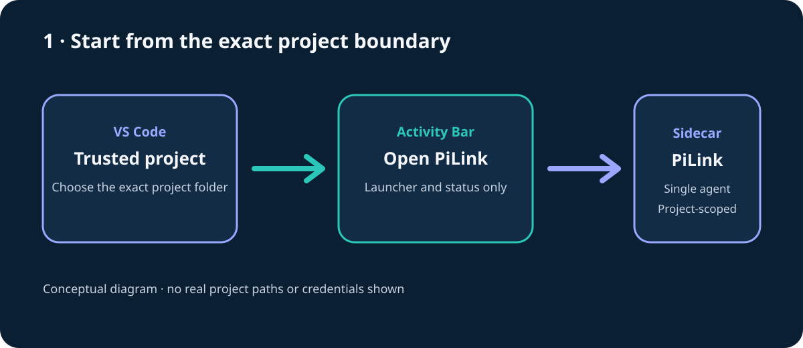
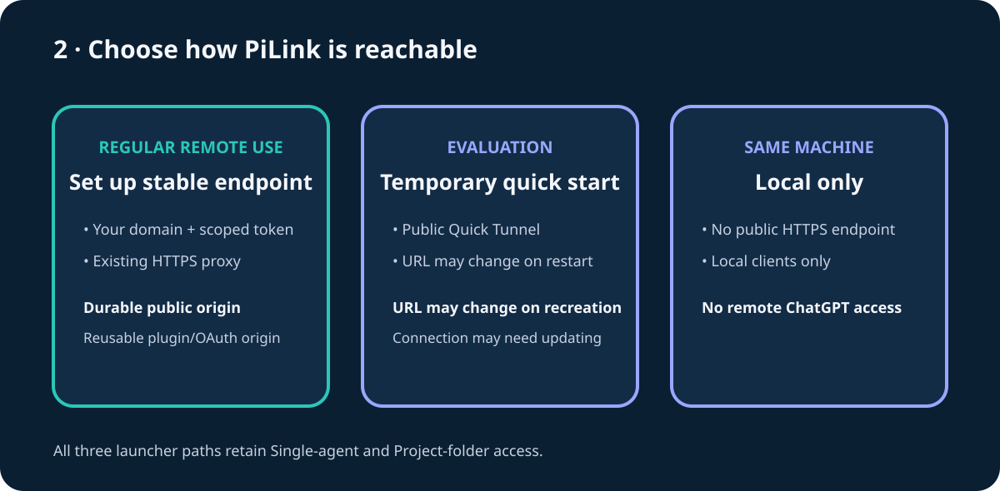
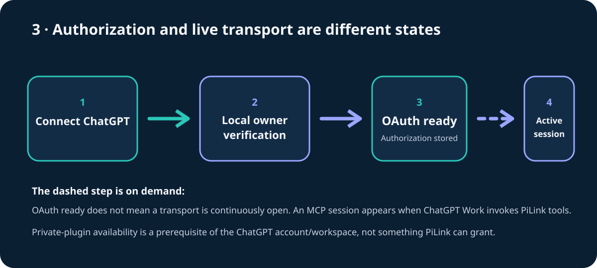
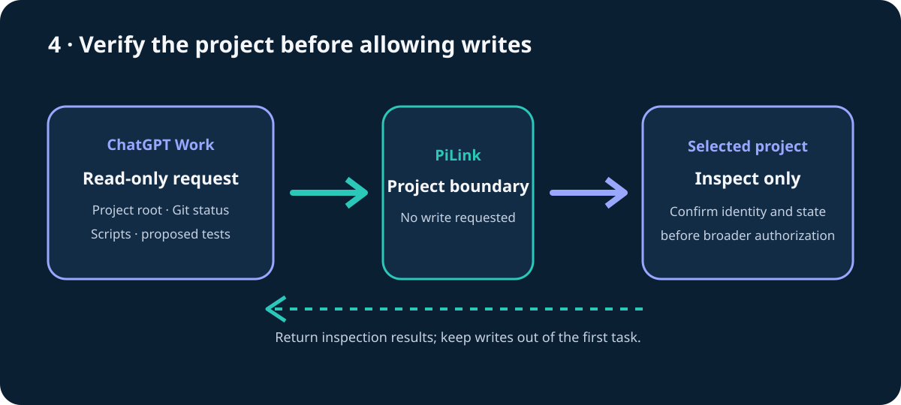

# Illustrated setup walkthrough

These are conceptual diagrams, not screenshots. They deliberately omit real domains, tokens, OAuth codes, usernames, project paths, and private plugin identifiers.

## 1. Open the trusted project



Use a supported VS Code installation and PiLink sidecar/runtime. Open the exact project PiLink may access, trust the VS Code window, then open **PiLink** from the Activity Bar.

The normal graphical path is **Single agent** with **Project-folder** access.

## 2. Choose the endpoint deliberately



Use **Set up stable endpoint** for normal remote ChatGPT Work use. A durable origin requires either a Cloudflare fixed domain you control with the required scoped token, or an existing HTTPS domain/reverse proxy you operate.

Use **Temporary quick start** only for evaluation. A Quick Tunnel is public but temporary; recreating it can change the public URL.

Use **Local only** when only same-machine clients need PiLink. Remote ChatGPT Work cannot reach a local-only endpoint.

## 3. Verify local ownership, then complete OAuth



Before remote authorization, PiLink performs a local owner-verification step. After that succeeds, complete OAuth for the private PiLink plugin available to your ChatGPT account/workspace.

**OAuth ready** means authorization is stored. It does not mean an MCP transport is active. A live session appears only when ChatGPT Work invokes PiLink tools.

## 4. Start with a read-only task



Begin with a bounded inspection request:

```text
Use PiLink to inspect the configured project. Report the project root, Git
status, package scripts, and the tests you would run. Do not modify files.
```

Verify the reported project before authorizing changes.

The VS Code dashboard shows server, endpoint, and ChatGPT authorization/connection state. It has no activity feed, task board, agent console, or transcript.

For the canonical sequence see [Getting started](GETTING_STARTED.md) and [Connect ChatGPT Work](CONNECT_CHATGPT.md). For launcher state and recovery see [PiLink for VS Code](VSCODE_EXTENSION.md).
