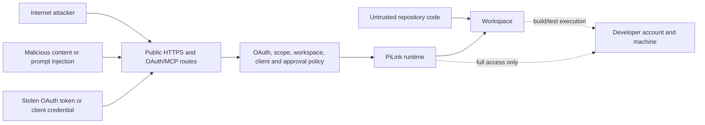

# Security model

PiLink gives an authenticated remote model tools on a developer machine.
That is a high-impact capability even when every component behaves as designed.
The objective is to make authority explicit, bounded, revocable, and
observable—not to describe arbitrary remote execution as risk-free.

## Security objectives

- Deny unauthenticated MCP tool use.
- Bind tokens to the expected issuer, resource/audience, client, generation,
  expiry, and scopes.
- Keep default filesystem operations inside one canonical workspace.
- Keep public protocol routes separate from local administration.
- Keep secrets and durable coordination state outside the workspace and
  webview.
- Require separate decisions for repository execution and unrestricted access.
- Make OAuth clients, tokens, sessions, and services revocable.
- Expose only bounded, metadata-only operational monitoring.
- Fail closed when identity, scope, private-state placement, or execution
  approval cannot be verified.

## Threat model

Controls reduce risk but do not eliminate the consequences of authorizing the
wrong client, accepting a malicious tool action, executing an untrusted
repository, or enabling Full access.

## Default workspace boundary

**Open folder** mode resolves paths against the canonical workspace root and
rejects traversal and symlink escape. It does not expose the general-purpose
shell. This is the recommended mode for an Internet-reachable endpoint.

The boundary protects paths, not the operating system account. If repository
execution is enabled, `npm build`, `npm test`, Git filters, compilers, or other
project code may still access whatever the OS user can access. PiLink
disables optional repository build/test profiles until the operator explicitly
sets the execution policy.

## Runtime capability modes

`PI_RUNTIME_MODE=single` is the least-capability remote catalog: it registers
the classic workspace harness and omits public chat, tasks, memory, work-loop,
and remote agent-management tools. A configured provider may back one local
agent through the separately authenticated loopback VS Code controller; that
agent receives no coordination permissions. `PI_RUNTIME_MODE=collaboration`
adds orchestration services for an operator who needs them. The additional catalog does
not imply broader filesystem or process authority; OAuth scopes, workspace
execution policy, Full-access client allowlists, and execution approvals remain
independent checks.

The VS Code graphical entry contains both catalogs and is not a security mode.
Its ChatGPT MCP/Pi Local selector chooses the client/provider surface, not the
server capability catalog. Mode changes are local operator actions and require
a restart. A prompt, task, public-chat message, model-visible environment
value, or workspace file cannot select a mode or elevate a running process.
See [Runtime mode selection](operations/mode-selection.md) for the migration
and headless procedures.

## Full access

Full access removes the workspace filesystem restriction and enables general
process execution. It is remote code execution with the permissions of the
PiLink user.

Enable it only when all of these statements are true:

- the machine/account is dedicated or otherwise acceptable to expose;
- the OAuth client and ChatGPT workspace are trusted;
- the selected client ID is reviewed and explicitly allowed;
- no other authorized client should inherit the permission;
- important data is backed up;
- the operator understands that PiLink is not an OS sandbox.

Do not enable Full access merely to fix OAuth, hosting, workspace selection, or
an empty collaboration monitor. Those are separate problems.

## OAuth boundaries

PiLink validates bearer tokens for every protected request. Authorization
Code clients use PKCE, and the server publishes OAuth/resource metadata for
compatible hosts. DCR is limited to the supported ChatGPT callback pattern and
creates a public client without a reusable client secret. Manual confidential
clients remain a compatibility fallback.

OAuth requirements include:

- exact registered redirect URIs;
- expected resource/audience propagation;
- issuer, signature, time, generation, client status, and scope validation;
- refresh rotation and revocation;
- session invalidation after client disable or secret rotation;
- rate and body-size limits;
- no public OAuth client administration API.

The official OpenAI authentication guidance recommends an established identity
provider for larger deployments. PiLink's self-contained authorization
server is useful for a self-hosted trusted-owner product, but it requires
ongoing protocol testing and independent security review before broad
multi-tenant use. See
[OpenAI plugin authentication](https://developers.openai.com/plugins/build/auth).

## Scope model

| Scope | Intended authority |
| --- | --- |
| `mcp:read` | Read, search, list, and other read-only projections |
| `mcp:write` | Mutating tools and constrained execution allowed by runtime policy |
| `mcp:tools` | All tools allowed by the selected runtime mode |
| `offline_access` | Refresh access for a durable authorized connection |

Scopes are necessary but not sufficient. A token with `mcp:tools` still cannot
bypass workspace mode, an execution opt-in, a per-client Full-access allowlist,
or a fresh execution-approval requirement.

## Local administration

Client lifecycle, collaboration projections, supervised-agent controls, and
private status are exposed only through the local administration channel. The
server requires loopback peer/host checks and a private bootstrap credential.
The public endpoint must not proxy `/admin/*` as an unauthenticated management
surface.

The VS Code webview never receives raw server secrets, Cloudflare credentials,
provider API keys, client-secret hashes, or complete private configuration.
Privileged copy operations are performed by the extension host and should
return the minimum value required for the user's immediate action.

## Secret storage

Keep these values out of repositories, prompts, agent chat, task artifacts,
screenshots, logs, browser URLs, and shell history:

- JWT and bootstrap secrets;
- OAuth client secrets, tokens, and authorization codes;
- Cloudflare certificates, tunnel tokens, and service credentials;
- provider API keys and device/OAuth tokens;
- local administration credentials.

Configuration and generated state must use private file modes. Extension-owned
secrets should use VS Code SecretStorage. A release package must be scanned for
private-key, certificate, token, credential, `.env`, client-store, and log
material before publication.

## Public hosting

- Prefer a stable Named Tunnel or well-managed reverse proxy.
- Keep the origin listener on loopback.
- Terminate HTTPS with a valid certificate.
- Expose only required MCP, OAuth, metadata, and bounded health routes.
- Configure proxy trust deliberately; do not trust arbitrary forwarded headers.
- Restrict browser CORS origins exactly. Wildcards and `null` are not safe
  substitutes.
- Treat Quick Tunnel as disposable evaluation infrastructure.
- Treat direct `nip.io` plus router mapping as legacy and explicitly exposed to
  the Internet.

A public `/sse` endpoint is not meant to render a webpage. A browser failure at
that path is not evidence that the MCP transport is offline.

## Hosting binary supply chain

The Linux bootstrap path pins both the version and SHA-256 of official GitHub
release assets for `cloudflared` 2026.7.2 and Caddy 2.11.4 on x64 and arm64.
PiLink verifies the complete file before installation or execution. Remote
plain HTTP is rejected, and redirects may not leave the HTTPS boundary. The
only plain-HTTP exception is a loopback host used by local automated tests.

Custom mirrors do not disable integrity enforcement. `PI_CLOUDFLARED_URL` must
be accompanied by `PI_CLOUDFLARED_SHA256`, and `PI_CADDY_URL` must be
accompanied by `PI_CADDY_SHA256`. Missing, malformed, or mismatched pairs fail
closed. Never replace a pinned digest merely to make an unexpected download
run; verify the mirror artifact independently first.

The URL and SHA-256 variables are non-secret integrity metadata. They must not
be stored or rendered as credentials, although an organization may treat an
internal mirror URL as private topology. Cloudflare tunnel tokens,
certificates, API tokens, and Named Tunnel credential files remain secret and
must follow the storage rules above.

## Collaboration safety

Agent messages, task text, memory entries, and artifacts are untrusted data.
They can coordinate work but cannot override the user's request, authenticated
scope, role assignment, or runtime security policy.

The monitor intentionally omits prompts, tool arguments, command text, paths,
file contents, results, and arbitrary error text from technical audit events.
The private ChatGPT transcript is not mirrored into PiLink.

Durable collaboration data must be outside the workspace. If the private data
directory is placed under the workspace, collaboration services should fail
closed instead of exposing their own authority state to workspace tools.

## Operational checklist

Before the first Internet-facing start:

- [ ] Node.js is exactly 24.18.0.
- [ ] The private data directory is outside the workspace and mode-protected.
- [ ] The selected workspace is the intended scope.
- [ ] Repository execution is disabled unless the repository is trusted.
- [ ] Full access is disabled unless a specific reviewed client requires it.
- [ ] HTTPS, OAuth discovery, issuer, resource, and callback behavior are
      tested.
- [ ] The public proxy does not expose local administration.
- [ ] OAuth revocation and client disable have been tested.
- [ ] Backups and recovery are documented.
- [ ] The exact release artifact has been scanned for secrets and reviewed.
- [ ] Automatically provisioned hosting binaries came from the pinned official
      source or a reviewed HTTPS mirror with an independently verified digest.

After a suspected compromise:

1. Stop the public tunnel and PiLink runtime.
2. Disable the affected OAuth client.
3. Revoke tokens and rotate client/server credentials as applicable.
4. Inspect metadata-only audit, system logs, Git state, and machine state.
5. Restore or rebuild the host if unrestricted execution may have occurred.
6. Reconnect only after the root cause and authorization boundary are
   understood.
